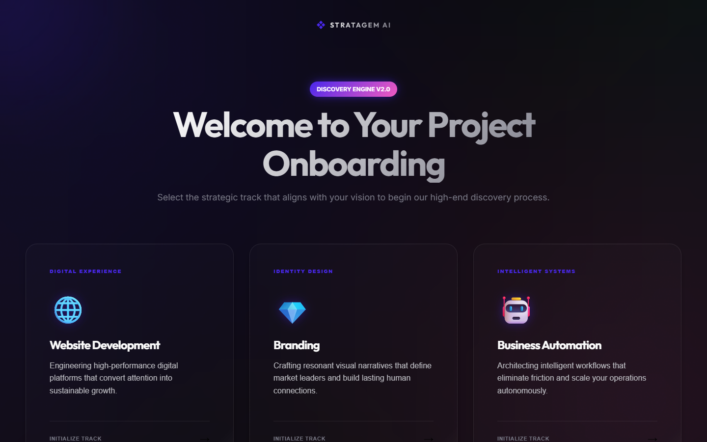
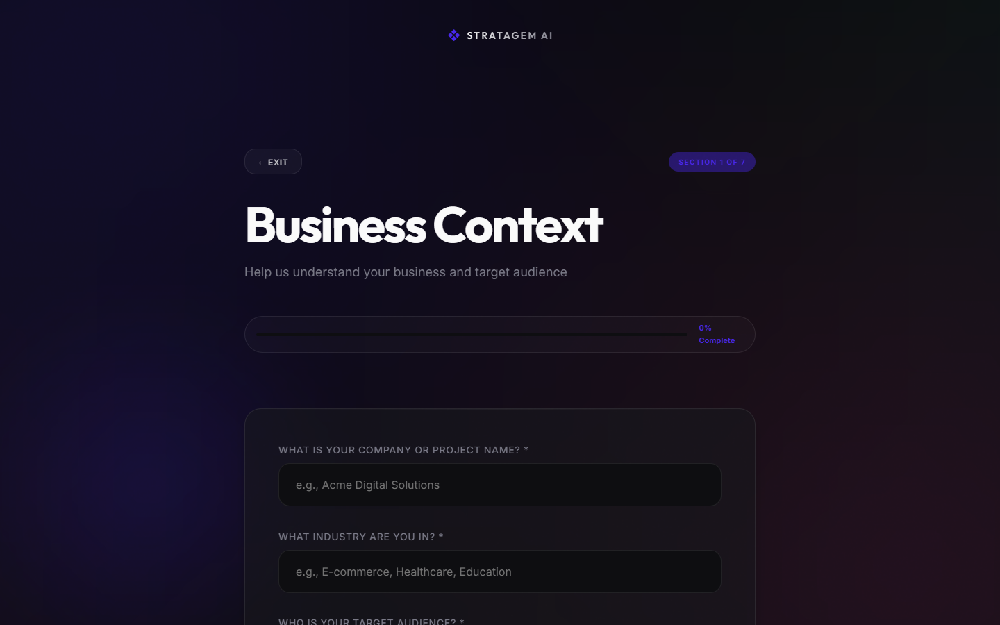
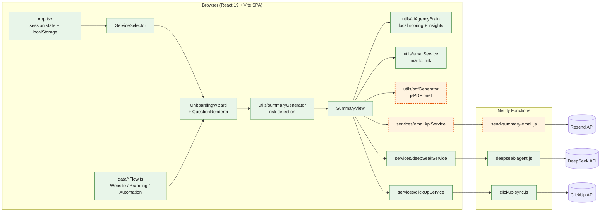

# AI Client Onboarding System

> A multi-step client discovery wizard for digital agencies. It asks adaptive interview questions, flags project risks, requests an AI analysis and cost estimate from DeepSeek, and can sync the result to ClickUp.

[](https://github.com/Sami123d/ai-client-onboarding-extended/actions/workflows/ci.yml)

## Screenshots

Captured from `npm run dev` on a local machine with no API keys set. The wizard itself runs fully client-side; only the AI analysis, ClickUp sync and email send need keys and the Netlify Functions runtime.

| Service selection | Wizard step |
|---|---|
|  |  |

## Status

- The wizard, risk detection, local scoring, PDF export and tests are working. The Vitest suite and the production build run in CI.
- Not deployed. There is no live demo. The Netlify Functions (DeepSeek proxy, ClickUp sync, Resend email) are covered by unit tests with mocked `fetch` only (the email function) or not tested at all (the other two). None of them has been checked end to end against the real APIs from this repository.

## What This Project Does

It is a branded, multi-step interview wizard that replaces manual client discovery calls for digital agencies. It has adaptive questions for each service type (Website / Branding / Automation) and automatic risk detection. It also produces an AI-generated project analysis and cost estimate, and can sync the result to ClickUp in one click. Session progress is saved in `localStorage`.

## What Was Changed vs. the Original

### 1. Real PDF export (`src/utils/pdfGenerator.ts`)
In the original, the "Print / Save PDF" button only called `window.print()`, so the output was whatever the browser's print dialog rendered, with no control over layout. This fork adds a branded PDF generator (using `jsPDF`). It builds a structured discovery brief (client profile, scope, risks, strategic insights, next steps) and downloads it as a real `.pdf` file. The original's own roadmap listed this as unimplemented ("Phase 2: PDF Export").

### 2. Real email delivery (`netlify/functions/send-summary-email.js`, `src/services/emailApiService.ts`)
The original's `emailService.ts` only built a `mailto:` link. That needed the user's own email client to be set up and open, and it did not send anything itself. This fork adds a real send path. A new Netlify Function forwards requests to the [Resend](https://resend.com) API, so the API key stays on the server (the same security pattern as the existing `deepseek-agent.js` and `clickup-sync.js` functions). Summaries can be sent straight to the agency team with one click, and the button shows an error message if delivery fails. The `mailto:` option is still there alongside it.

### 3. Test suite (`src/utils/*.test.ts`, `tests/`)
The original had no automated tests. This fork adds a Vitest suite that covers the two "intelligence" modules: `aiAgencyBrain` (confidence scoring, insight generation) and `summaryGenerator` (risk detection). It also covers the new PDF section-building logic and the `send-summary-email` function handler (with `fetch` mocked). The PDF renderer is split into a pure data-shaping function (`buildBriefSections`, tested directly) and a thin wrapper that calls `jsPDF`, so the tests don't need a canvas or DOM environment.

### 4. `.env.example` added
The original README told users to run `cp .env.example .env`, but the repository had no `.env.example` file. This fork adds one, including the new `RESEND_*` and `AGENCY_TEAM_EMAIL` variables.

### 5. Netlify Functions load as ES modules
`client-onboarding/package.json` declares `"type": "module"`, but all three functions used CommonJS (`require('node-fetch')` / `exports.handler`). Loading them in Node fails with `require is not defined in ES module scope`. They now use `export const handler` and Node's built-in `fetch`. The email function also HTML-escapes the client-supplied fields before putting them into the email body.

### Not carried over
`PROGRESS.md` and `project_requirements.md` from the source repo were internal build-session logs and specification drafts, not user-facing documentation, so they weren't copied into this repository.

## My contributions

The original extension work was imported as **one squashed commit** ([`45b4743`](https://github.com/Sami123d/ai-client-onboarding-extended/commit/45b47436444af74d991e3322c1f588db88e497fb)), so there is no separate commit for each change. For those rows, the links below point to the files. Later changes do have their own commits.

| Change | Files | Commit |
|---|---|---|
| Branded PDF export (jsPDF) | [`src/utils/pdfGenerator.ts`](client-onboarding/src/utils/pdfGenerator.ts), [`src/components/SummaryView.tsx`](client-onboarding/src/components/SummaryView.tsx) | squashed in [`45b4743`](https://github.com/Sami123d/ai-client-onboarding-extended/commit/45b47436444af74d991e3322c1f588db88e497fb) |
| Email delivery via Resend | [`netlify/functions/send-summary-email.js`](client-onboarding/netlify/functions/send-summary-email.js), [`src/services/emailApiService.ts`](client-onboarding/src/services/emailApiService.ts), [`src/components/SummaryView.tsx`](client-onboarding/src/components/SummaryView.tsx) | squashed in [`45b4743`](https://github.com/Sami123d/ai-client-onboarding-extended/commit/45b47436444af74d991e3322c1f588db88e497fb) |
| Vitest suite (brain, summary, PDF) | [`src/utils/aiAgencyBrain.test.ts`](client-onboarding/src/utils/aiAgencyBrain.test.ts), [`src/utils/summaryGenerator.test.ts`](client-onboarding/src/utils/summaryGenerator.test.ts), [`src/utils/pdfGenerator.test.ts`](client-onboarding/src/utils/pdfGenerator.test.ts), [`vite.config.ts`](client-onboarding/vite.config.ts) | squashed in [`45b4743`](https://github.com/Sami123d/ai-client-onboarding-extended/commit/45b47436444af74d991e3322c1f588db88e497fb) |
| `.env.example` | [`client-onboarding/.env.example`](client-onboarding/.env.example) | squashed in [`45b4743`](https://github.com/Sami123d/ai-client-onboarding-extended/commit/45b47436444af74d991e3322c1f588db88e497fb) |
| ESM Netlify Functions, HTML escaping, email handler tests | [`netlify/functions/`](client-onboarding/netlify/functions), [`tests/send-summary-email.test.js`](client-onboarding/tests/send-summary-email.test.js) | [`bed02a0`](https://github.com/Sami123d/ai-client-onboarding-extended/commit/bed02a024773e25df47c33010f12bf4a48241b9d) |
| GitHub Actions CI (Vitest + build) | [`.github/workflows/ci.yml`](.github/workflows/ci.yml) | [`287db53`](https://github.com/Sami123d/ai-client-onboarding-extended/commit/287db5300396e7a911bd9042d120e9b2fcc0ef26) |

## Architecture

Green nodes (solid border) are from the original project. Orange nodes (dashed border) were added in this fork.



**Legend:** green = original (Sami Ahmed), orange dashed = added in this fork. `SummaryView` is original but was modified to add the "Download PDF" and "Send to Team Now" buttons.

## Tech Stack

React 19, TypeScript, Vite 7, Netlify Functions, DeepSeek API, ClickUp API, Resend (new), jsPDF (new), Vitest (new).

## Project Structure

```
netlify.toml                  Netlify build config (base dir: client-onboarding)
client-onboarding/
  src/components/             Wizard, service selector, summary view, form inputs
  src/data/                   Question flows per service type
  src/utils/                  summaryGenerator, aiAgencyBrain, emailService, pdfGenerator (+ tests)
  src/services/               Browser clients for the Netlify Functions
  netlify/functions/          deepseek-agent, clickup-sync, send-summary-email
  tests/                      Netlify Function handler tests
```

## Getting Started

Requires Node 20.

```bash
git clone https://github.com/Sami123d/ai-client-onboarding-extended.git
cd ai-client-onboarding-extended/client-onboarding
npm ci
cp .env.example .env
npm run dev        # http://localhost:5173
```

The wizard runs without any keys. The AI analysis, ClickUp sync and email buttons call `/.netlify/functions/*`, which only exists under Netlify. To run the functions locally:

```bash
npm install -g netlify-cli
netlify dev
```

## Environment Variables

These are read by the Netlify Functions on the server, not by the browser bundle.

| Name | Used by | Purpose |
|---|---|---|
| `VITE_DEEPSEEK_API_KEY` | `deepseek-agent.js` | DeepSeek API key for analysis, cost estimate and chat |
| `VITE_CLICKUP_API_KEY` | `clickup-sync.js` | ClickUp personal API token |
| `VITE_CLICKUP_LIST_ID` | `clickup-sync.js` | ClickUp list that new tasks are created in |
| `RESEND_API_KEY` | `send-summary-email.js` | Resend API key |
| `RESEND_FROM_EMAIL` | `send-summary-email.js` | Sender address (defaults to `onboarding@resend.dev`) |
| `AGENCY_TEAM_EMAIL` | `send-summary-email.js` | Recipient for "Send to Team Now" |

## Testing

```bash
cd client-onboarding
npm test           # Vitest, 16 tests, no network access
npm run build      # tsc -b && vite build
```

CI runs both on every push to `main` ([workflow](.github/workflows/ci.yml)). `npm run lint` currently reports errors in the original code (`no-explicit-any`, unused variables in `vite.config.ts`), so it is not part of CI yet.

## Deployment

**This repository is not deployed.** The included `netlify.toml` is set up for Netlify:

1. In Netlify, create a site from this GitHub repository. `netlify.toml` already sets **Base directory** `client-onboarding`, build command `npm run build`, publish directory `dist`, functions directory `netlify/functions`, and an SPA fallback redirect to `/index.html`.
2. Under Site settings → Environment variables, add the variables from the table above.
3. Deploy, then check the ClickUp sync and email buttons against the real services.

## Known Limitations

- `send-summary-email` has no authentication or rate limiting. When called with `recipientType: "client"`, it sends to whatever email address is in the request body. The UI only uses `"team"`, but before deploying publicly, restrict the function to the team recipient or add auth.
- The other two functions (`deepseek-agent`, `clickup-sync`) have no tests.
- The production bundle is about 640 kB (Vite warns about chunk size). jsPDF could be loaded lazily.

## Roadmap

- Lazy-load the PDF generator.
- Restrict or authenticate the email function.
- Fix the lint errors and add linting to CI.

## License

MIT License. See [LICENSE](LICENSE). Original work by Sami Ahmed. Modifications in this repository are released under the same license.

## Attribution

- **Original project and architecture:** [Sami Ahmed](https://github.com/sami123d)
